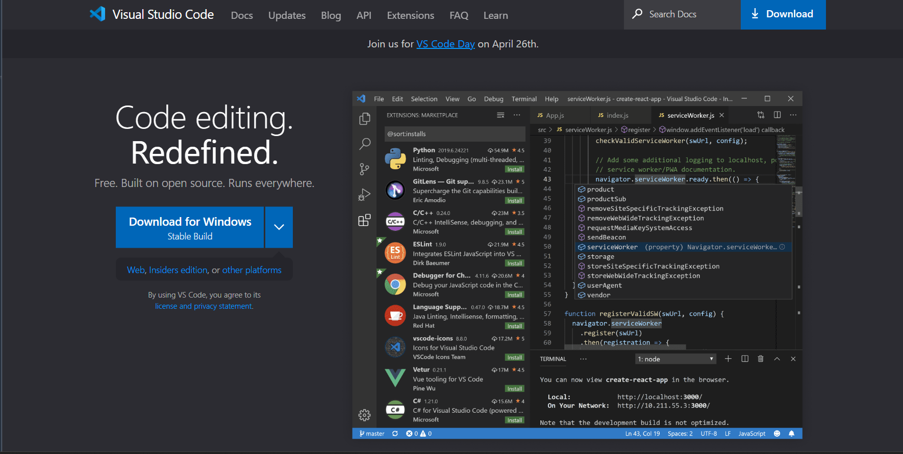
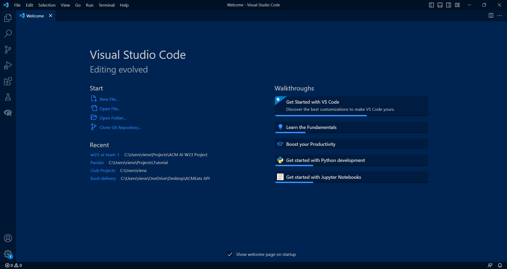
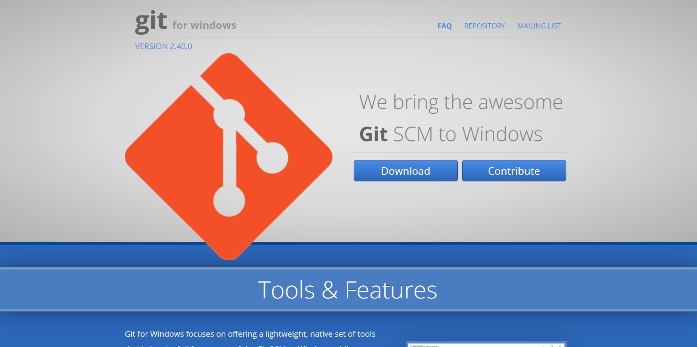
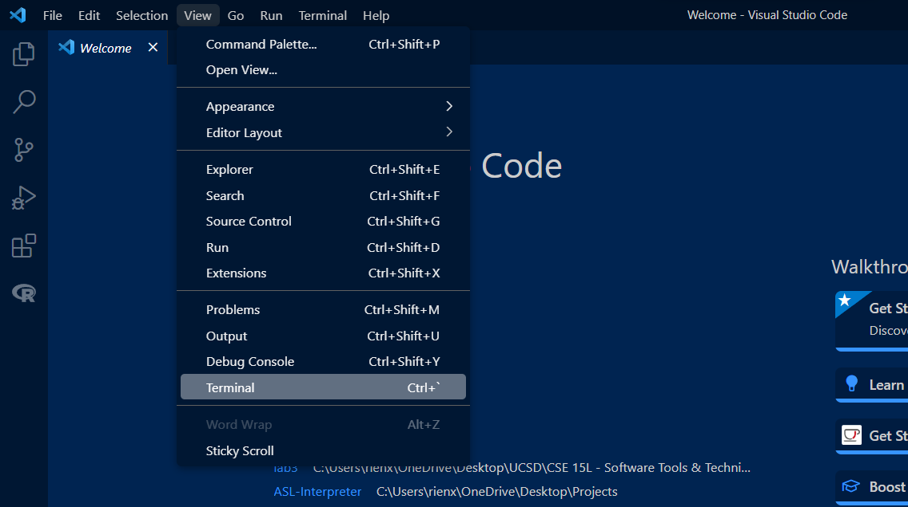
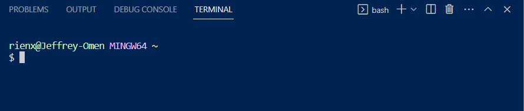
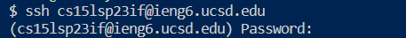
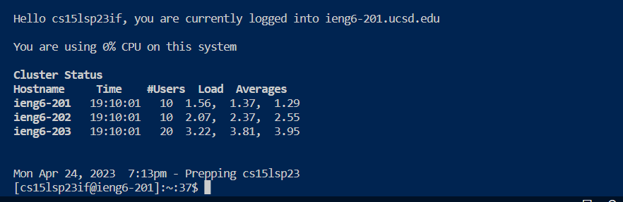
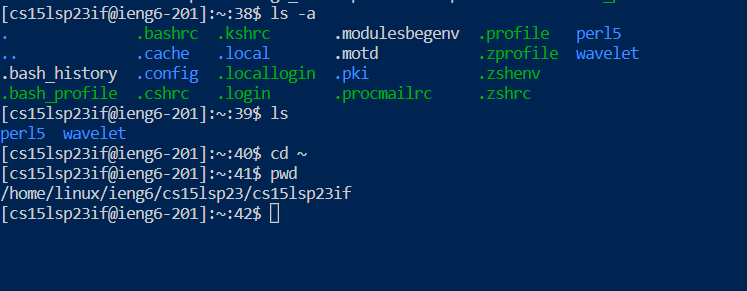
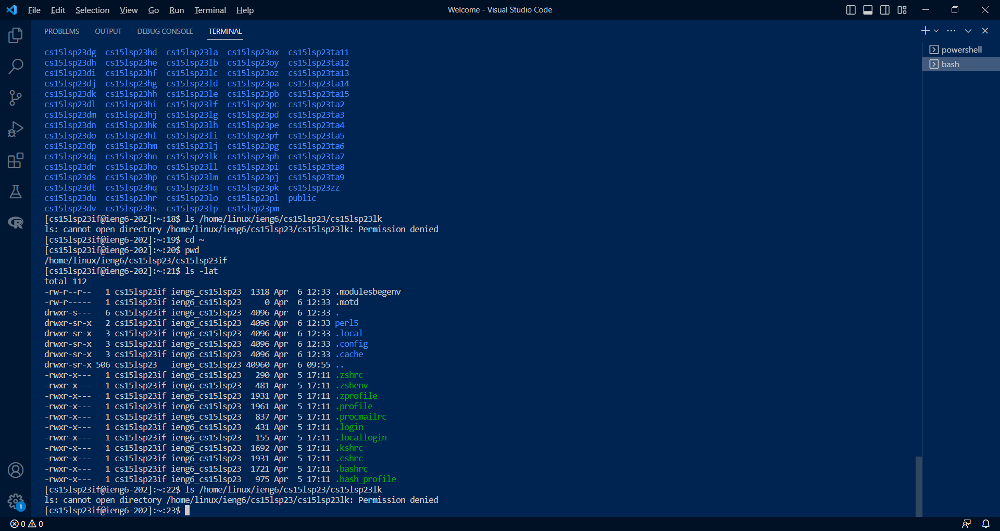

# Lab Report 1: Remote Access and File System
---
## Step 1: Installing VScode
1. To have everything setup, you first want to make sure that you have a code editor set up, in this lab we are using Visual Studio Code, so if you don't have it downloaded already, you can download from this link to [the Visual Studio Code website](https://code.visualstudio.com/) and click download to install Visual Studio Code on your computer, the screen where you can find this will be similar to the screenshot below.

2. Follow the instructions to complete the installation process and open VScode, the window should look similar to the image below.

3. In the next section, you will begin using the terminal in VSCode to connect to a remote server!

*Note: As I already had Visual Studio Code installed on my computer, I did not need to follow these setup instructions and just opened the application directly*

## Step 2: Remotely Connecting
1. Now with VSCode set up you can now try remotely connecting to one of the computers in the CSE Basement! First, if you're using a Windows computer, ensure that you have [Git for Windows](https://gitforwindows.org/) installed (go to the link, click download, and follow the installation instructions).

2. Once Git is installed, follow [these instructions from this post on Stackoverflow](https://stackoverflow.com/questions/42606837/how-do-i-use-bash-on-windows-from-the-visual-studio-code-integrated-terminal/50527994#50527994) to begin using Bash in the VSCode terminal. This post on stackoverflow discusses how to set up Bash to be used in the VSCode terminal.
3. Now you will want to access the VSCode terminal, to do that you can go to View -> Terminal or you can simply type Ctrl (or Command) + \`

4. Now your terminal will pop up and you can begin writing your commands into the terminal, when you see the `$` that is the convention for where you will be writing your commands. Your terminal should look similar to this screenshot (except with your own device account information):

5. To connect remotely to one of the computers in the CSE Basement (your sesrver), you first type this command into the terminal: `$ ssh cs15lsp23xx@ieng6.ucsd.edu` where `xx`is replaced by the last 2 letters in your own course-specific account. Here is my screenshot of my attempt to log into my remote server and the prompt afterwards that asks for your own password. Here, my account is `cs15lsp23if`, but in your case you might have different letters for your account instead of `if`.

6. If you're logging into your account for the first time, you will be prompted `Are you sure you want to continue connecting (yes/no/[fingerprint])?`, type `yes` and then enter
7. Now you will see the prompt for you password, type it in (and don't worry if it looks like you aren't typiing in anything, just type in your password and press enter when you're finished).
8. Once you've successfully logged in and are remotely connected to the server, you will receive output similar to the screenshot below.

9. If you see something similar, then congratulations! You're done remotely connecting and now you can move on to trying some commands in the terminal of your remote server. Note that from now on, you are navigating around the device of one of the computers in the CSE Basement and no longer your local device once you've logged into the server.

## Step 3: Trying Some Commands
1. Wrtiting commands in the terminal allows you to navigate through and manipulate files in your device. Here are some useful commands you can try using in both your local device and the device you just remotely connected to!
2. Here are some commands you can try:
* `cd` *"Change Directory": This command will change your current directory to the directory of a given path following this command*
* `cd ~` *Switches your current directory to the home directory*
* `ls` *"List": Lists files and folders in the given path, defaulting to the current directory if no path is given*
* `ls -lat` *Lists all files in the directory sorted by date*
* `ls -a` *Lists all files int eh directory including hidden files*
* `ls /home/linux/ieng6/cs15lsp23/cs15lsp23xx` (`xx` is the last 2 letters of someone else's account) *This should list the files in the directory of another account, however if you test it out, you may see that you cannot access someone else's account*
* `pwd` *"Print Working Directory": gets and shows your current directory*
* `mkdir` *"Make Directory": allows you to create a directory of the given path*
* `cp` *"Copy": allows you to copy files and directories to a given path destination*
* `cp /home/linux/ieng6/cs15lsp23/public/hello.txt ~/` *Copies the file of hello.txt to the home directory"*
* `cat /home/linux/ieng6/cs15lsp23/public/hello.txt` *"Concatenate": reads out the data/text from a file (in this case, hello.txt) and outputs it into the terminal*
3. Here's a demonstration of some of the commands above:

*An example of testing out some commands*
4. When you are done testing commands, you can logout of the remote server by typing Ctrl-D or `exit` in the terminal.
5. That's all for the lab tutorial! You can now try navigating and manipulating directories and files in your local device or on the remote servers.

*Note For Lab Report Resubmission: Responded to feedback by including screenshot of successful login to remote server, explaining what some of the commands do and demonstrating their behavior, and made my written steps more detailed and engaging with full sentences.*
