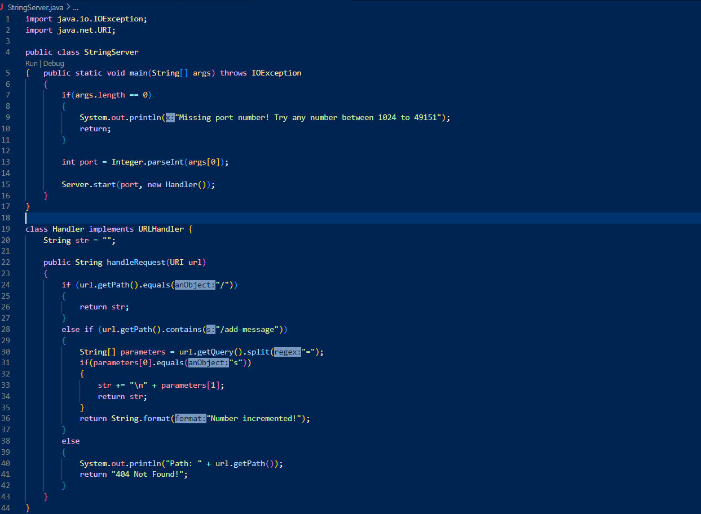
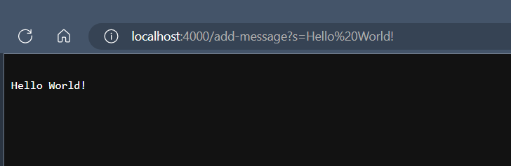
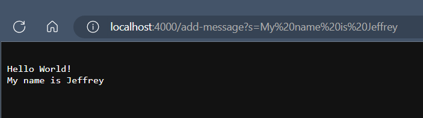
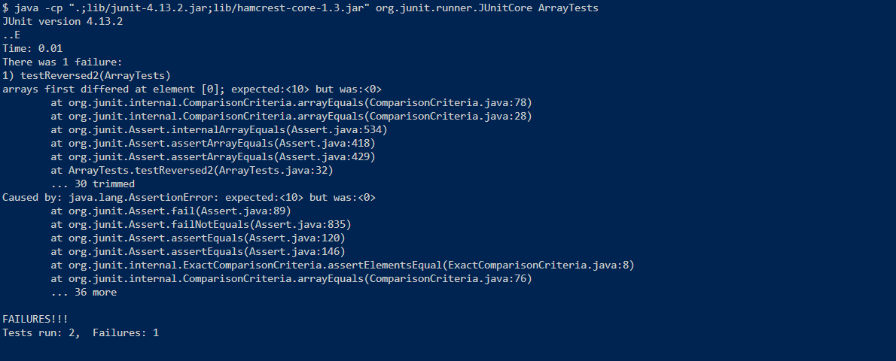

# Lab Report 2: Servers and Bugs

---
## Part 1: StringServer
* Here is the code I wrote for String Server: 

* When the code is run, the main method is called, which starts a server with a given integer value as a port number and additionally initializes a Handler object to handle requests when there is a change in the URL. In the following screenshots, I used the port number 4000.
* When the server is started, the page is blank as the only value that is initialized to appear on the page of the root path when the server first starts is an empty String value
* My first change to the URL happens when I append `/add-message?s=Hello World!` to the root path of the URL, this is what I now see on the page after making this change: 
 * The change in the URL calls the handleRequest method in the Handler class, passing in the current URL as a URI value, the URL with this change is `http://localhost:4000/add-message?s=Hello World!`
 * In the method, it checks if the path contains the `/add-message` argument, since the URL does contain this argument, it retrieves the query in the URL path
 * The query from this path is the part of the path that follows the `?` and therefore is the String `s=Hello World!`
 * The code further checks if the first part of the query separated by the `=` is `s`, since it is, it retrieves the String value of the query that follows the `=` which in this case is `Hello World!`
 * This String, `Hello World!` is then appended to the empty String that is to be displayed in the page, resulting in what is seen in this screenshot
* My second change to the URL happens when I change the query to `/add-message?s=My name is Jeffrey`, this is what I now see on the page after making this change: 
 * The change in the URL calls the handleRequest method in the Handler class, passing in the current URL as a URI value, the URL with this change is `http://localhost:4000/add-message?s=My name is Jeffrey`
 * In the method, it checks if the path contains the `/add-message` argument, since the URL does contain this argument, it retrieves the query in the URL path
 * The query from this path is the part of the path that follows the `?` and therefore is the String `s=My name is Jeffrey`
 * The code further checks if the first part of the query separated by the `=` is `s`, since it is, it retrieves the String value of the query that follows the `=` which in this case is `My name is Jeffrey`
 * This String, `My name is Jeffrey`is then appended to the current String value that is to be displayed in the page, resulting in what is seen in this screenshot


## Part 2: Bug
For this part of the lab report, I have chosen the `reversed` method in the `ArrayExamples` methods to test:
* This is a JUnit test that I have written testing a failure-inducing input to the buggy `reversed` method:
```
@Test
  public void testReversed() 
  {
    int[] input1 = { 0 };
    assertArrayEquals(new int[]{ 0 }, ArrayExamples.reversed(input1));
  }
```
* This is a JUnit test that I have written testing an input that does not induce a failure from the program:
```
@Test
  public void testReversed2() 
  {
    int[] input1 = { 2, 4, 6, 8, 10 };
    assertArrayEquals(new int[]{ 10, 8, 6, 4, 2 }, ArrayExamples.reversed(input1));
  }
```
* After running the two JUnit tests, here are the produced symptoms from the bug in the program:

* The bug in the code that produces the symptom as shown above is the fact that the method creates a new integer array (as expected) but then assigns all of the values in the integer array that is passed in to the values in the new array, setting all of the values to the original integer array to the default integer value (0). At the end, the method doesn't even return the new array but instead returns the original array that was passed in. Here is the code that is being described:
```
static int[] reversed(int[] arr)
  {
    int[] newArray = new int[arr.length];
    for(int i = 0; i < arr.length; i += 1)
    {
      arr[i] = newArray[arr.length - i - 1];
    }
    return arr;
  }
```
* After fixing the bug, here is how the code now looks like:
```
static int[] reversed(int[] arr) {
    int[] newArray = new int[arr.length];
    for(int i = 0; i < arr.length; i += 1) {
      newArray[i] = arr[arr.length - i - 1];
    }
    return newArray;
  }
```
* To fix the code, what I did was that I made it so that the values that were being chaned were the corresponding elements in the new array instead of the original array that was passed in. This is done by iterating through the new array and assigning the element at the current index the corresponding index from the end of the original array that was passed in (to reverse the array). At the end, I returned the new array instead of the old one.


## Part 3: What I've learned
From my lab in week 2, I learned a lot about starting servers and how servers handle requests with changes to the URL. Furthermore, I have learned how behind the scenes, the information can be used as input to affect the information that is accessed and used in the pages displayed by the server. In this way, I understand more how software and web pages are able to interact with users in different ways.

*Note for Lab Report Resubmission: I have saved and resubmitted my lab Report in the corrected format*
