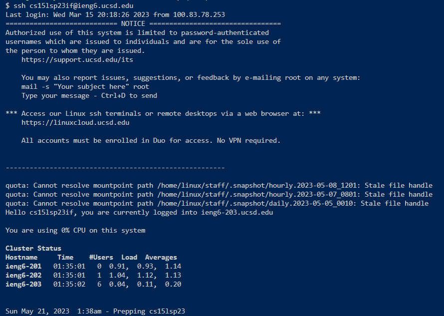
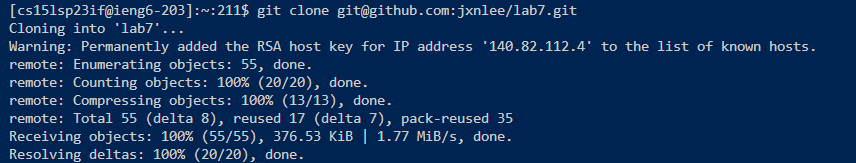
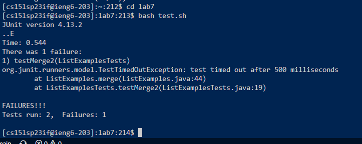
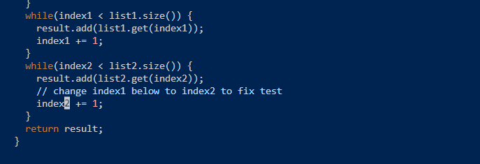
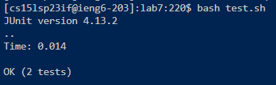
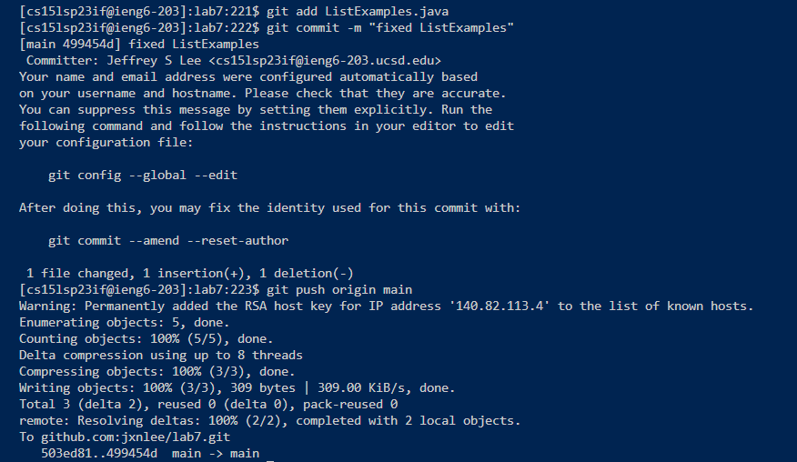

# Lab Report 4: Doing it All from the Command Line

---

## Tasks:

### 1. Log into `ieng6`

* Keys pressed: `<up><enter>`
* Typed Command: `ssh cs15lsp23if@ieng6.ucsd.edu`
* Explanation: To log into my `ieng6`, I typed in the command `ssh cs15lsp23if@ieng6.ucsd.edu` to remotely connect to the server. Since I had setup an SSH key to log into this account, I didn't need to type in my password this time and was able to login immediately.

### 2. Clone fork of repository from Github account

* Keys pressed: `<Ctrl>`r + 'git cl' + `<enter>`
* Typed Command: `git clone git@github.com:jxnlee/lab7.git`
* Explanation: Since I had previously performed these tasks before, to clone the repositlory I only needed to type `<Ctrl>`r to search through my history of commands and type the first few letters of the command in order to fully type the command `git clone git@github.com:jxnlee/lab7.git` to clone the repository.

### 3. Run failing tests

* Keys pressed: 'cd l' + `<tab><enter>` + `<Ctrl>`r + 'ba' + `<enter>`
* Typed Command: `cd lab7` + `bash test.sh`
* Explanation: Before running the tests, I needed to enter the directory for `lab7`, since I knew this directory was now in my current directory and was the only one that started with the letter 'l', I only needed to type `cd` + 'l' to change the directory to `lab7`. To run the tests, I simply needed to search through my history of commands with `<Ctrl>`r with the first few letters for the command `bash test.sh` to run the tests. As indicated in the screenshot, there is a bug in the ListExamples.merge method which produces an error in the testMerge2 test.

### 4. Edit code to fix failing test

* Keys pressed: `<Ctrl>`r + 'vi' + `<enter>`
* Typed Command: `vim ListExamples.java`
* Explanation: To edit the code, I first needed to enter `vim` for ListExamples.java. Since I had performed this task earlier, I searched through my history of commands with `<Ctrl>`r along with the first few letters of the `vim ListExamples.java` command to access the code.

* Keys pressed: '/cha' + `<enter><down><right><right>` + 'x' + 'i' + '2' + `<esc>` + ':wq'
* Typed Command: (commands to navigate through vim)
* Explanation: To edit the bug in the code, I first navigated to the error by searching for the comment indicating the location of the error which states "change index 1 below to index2 to fix test" with the bug located in the line below. First I typed `/` to use the search command in vim to locate the word "change" and navigated to its location with the first few characters. Then I used the arraow keys to navigate specifically to where the bug is located, pressed the `x` command to delete the character '1' in 'index1', entered 'insert mode' with the vim command `i` and then replaced the deleted character with '2'. To save these changes, I exited insert mode by pressing `<esc>` and typed the `:wq` command, which saves the changes and quits vim.

### 5. Run successful tests

* Keys pressed: `<Ctrl>`r + 'ba' + `<enter>`
* Typed Command: `bash test.sh`
* Explanation: To verify that the change is successful, I run the tests the same way I demonstrated the failed tests, by searching for the `bash test.sh` command with `<Ctrl>`r. As shown in the screenshot, all tests successfully passed.

### 6. Commit & pushing resulting changes to Github account

* Keys pressed: `<Ctrl>`r + 'git a' + `<enter>` +  `<Ctrl>`r + 'git c' + `<enter>` + `<Ctrl>`r + 'git p' + `<enter>`
* Typed Command: `git add ListExamples.java` + `git commit -m "Fixed ListExamples"` + `git push origin main`
* Explanation: Since I had used these git commands before in the tasks earlier, I only needed to search for each of the commands with `<Ctrl>`r and the first few letters of each command. So `<Ctrl>`r + 'git a' typed the `it add ListExamples.java` command,  `<Ctrl>`r + 'git c' typed the `git commit -m "Fixed ListExamples"` command, and `<Ctrl>`r + 'git p' typed the `git push origin main`. The first one added the file to the changes that needed to be committed and pushed, the second command commits the results, and the last command pushes the results to the repository to save the changes to the main branch.

*Note: Since I had performed the tasks in the account earlier, I am able to quickly put in the commands by searching through my history, otherwise I would alternatively type in the commands as I would normally without the history*
