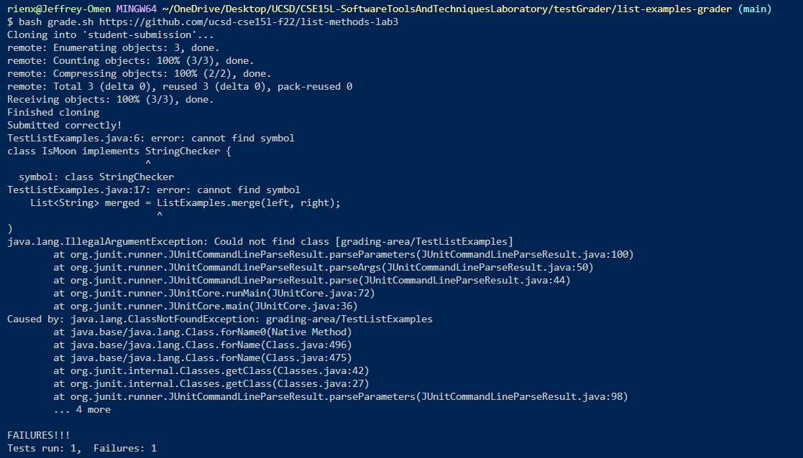
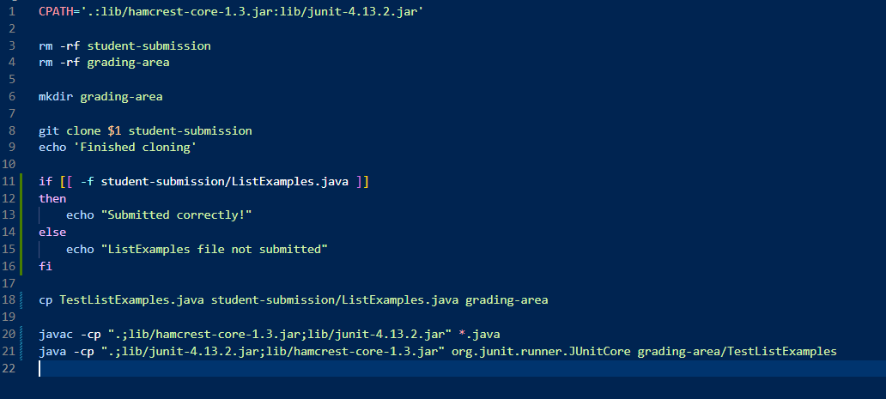
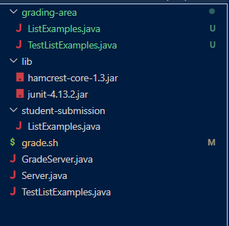
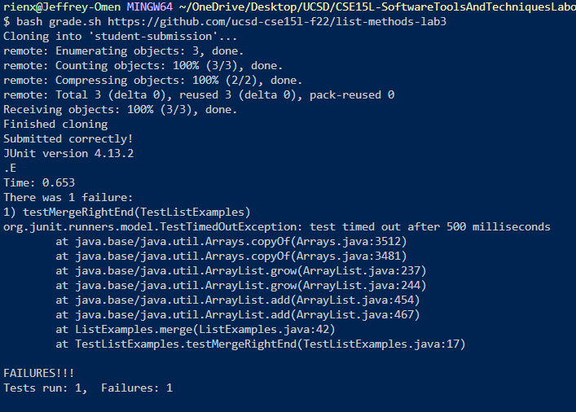
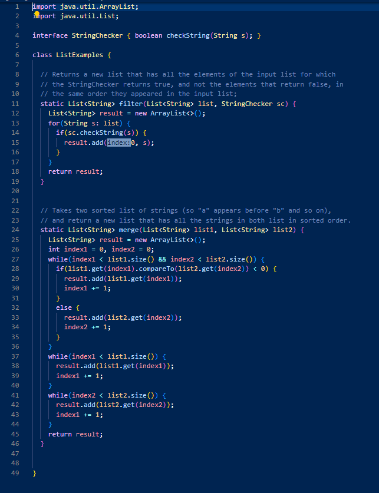
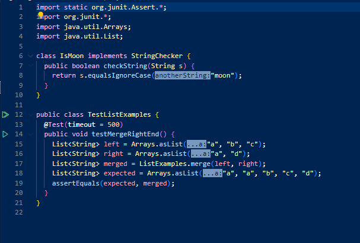
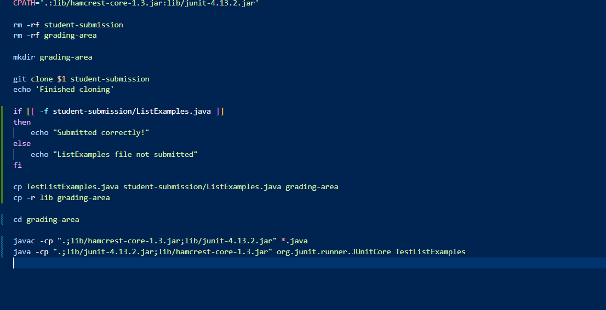

# Lab Report 5: Debugging & Reflection
## Part 1: Debugging Scenario
1. Student Post:
  * Environment: I am using a Windows 11 Computer and editing my code with VSCode and running it with bash script through the terminal
  * Symptom: When I try running grade.sh (for the grader project in lab 6) through the terminal, this is what I get:  I am aware that the failure-inducing input is the file path: `grading-area/TestListExamples`. I want to run TestListExamples in the `grading-area` directory that it has been copied to but it can't seem to find and run the class. When I try getting rid of `grading-area/`, it also produces a symptom where it can't run the ListExamples class that should have been copid to `grading-area`.
  * Here are the commands I'm running and the file structure: 
  
      
     
      
     
     My working directory is the `/list-examples-grader` directory and the command I use to run the bash script is `bash grade.sh https://github.com/ucsd-cse15l-f22/list-methods-lab3`
2. TA Response: You can't run the TestListExamples class from your current working directory `list-examples-grader`. If you want to run and compile the TestListExamples java file, you will need to change directory to `grading-area` before running and compiling them. Before that, since you want to run JUnit tests in the `grading-area` directory, you may want to also copy the `lib` directory into `grading-area`.
3. Student Response: Ok I tried making those changes, and here is the output I got (which is the correct and expected output): 

    
   
   So the bug was that the script was attempting to run a class by the name of "grading-area/TestListExamples" rather than "TestExamples" as I would want. Since the desired class was in another directory, I needed to change the directory before running and compiling the tests. Also I needed to make sure that I recursively copied the lib folder so that the JUnit tests would work.
4. Setup Info:
  * File & Directory Structure: 
  
     
     
  * Contents before bug fix: 
  
     grade.sh before bug fix:
     
      
     
     ListExamples.java:
     
      
     
     TestListExamples.java:
     
     
     
  * Commands: `bash grade.sh https://github.com/ucsd-cse15l-f22/list-methods-lab3` which ran the bash script grade.sh with the github repo as an argument
  * Bug Fix: To fix the bug, just add `cd grading-area` before running and compiling the JUnit tests with the class name changed from `grading-area/TestListExamples` to `TestListExamples`, before chaning to the `grading-area` directory, recursively copy the `lib` folder with `cp -r lib grading-area` 
  
   grade.sh after the bug fix:
   
   
   
## Part 2: Reflection
In the second half of the quarter, something that I learned from my lab experience that I didn't know before was how the output and the error output from files and commands could be redirected and used through bash script. I found this to be particularly interesting in week6s lab where we were able to learn a little about how graders can use bash script to grade coding submissions. After learning about this, I am interested in how more combinations ofcommands, bash script, code, and files can work and interact with each other. 
Another one of the most useful things that I have learned in this second half of the quarter is the use of shortcuts, whether it is the ssh key to quickly remotely access a server or the command and vim shortcuts, I found these to be very useful in working in the command line.
